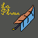

# La Pluma 羽毛笔
*为Minecraft所开发的用于呈现交互式文字小说内容的演绎工具*



客户端方面基于Forge平台所开发, 主要开发面向版本为Minecraft 1.12.2, 并且Minecraft 1.16.5也在移植中并同步进行更新. 

服务端方面兼容Spigot, 以插件形式运行, 提供较多API与客户端Mod交互。Sponge版本开发中. 

该项目基于 GPL 3.0 协议开源 - 由 SkyPixel Dev 维护更新

## 使用
Mod作为一种演绎工具, 其故事剧本由 **.journal** 格式的文件所描述。该格式包含Prompt、Selection、Function以满足不同功能. 
具体格式规范见: [La Pluma Journal格式规范](https://shimo.im/docs/m8AZVBJnXoToOJAb)

所有故事的资源文件应以资源包(Resourcepack)形式引入
```
assets/
    lapluma/
        avg/        立绘中CG、背景、人物立绘等资源引入
        icon/       页面UI的图标自定义
        journals/   .journal文件故事剧本
        musics/     音乐资源引入
        sounds/     页面交互音效自定义
```

目前, 在游戏中可以通过指令调出对应剧本进行播放演绎, 服务端也可以通过指令使装有对应Mod与资源包的玩家播放剧情.

## 开发计划
施工中

## 特别感谢
施工中